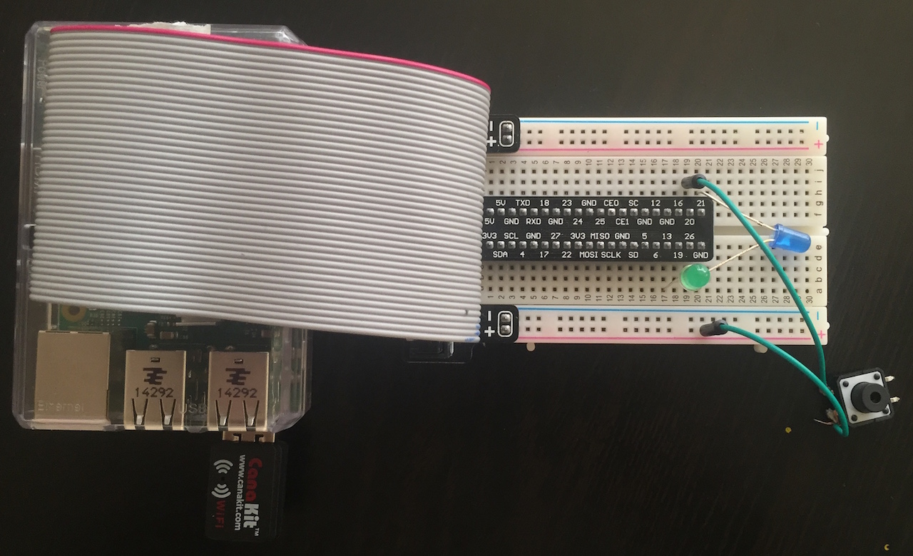
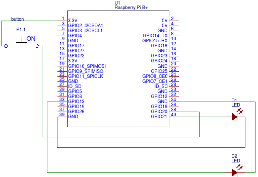

You will need the following hardware in order to trigger alerts from ReachPlus Alerts using a panic button.

- Raspberry PI 
- IDC connector cables
- One push button
- One green LED
- One blue LED



Setting up the hardware
-----------------------

**Blue LED**

- Connect the ground end of the LED to pin 39 which is ground
- Connect the positive end of the LED to pin 40 which is GPIO

**Green LED**

- Connect the ground end of the LED to pin 34 
- Connect the positive end of the LED to pin 33 which is GPIO

**Push Button**

- Using the IDC connector cables, connect one end of push button to pin 1 which is 3.3V and other end to pin 38 which is GPIO



Software
-----------------------
We will be using Python scripting to work with the GPIO's of the Raspberry Pi.

**Step 1:**

We have started by importing certain modules we will need
```xml
import thread

import RPi.GPIO as GPIO
from time import sleep

import requests
from requests.auth import HTTPBasicAuth 
```

*thread*	- helps us to create threads

*RPi.GPIO* - will be used to work with Raspberry Pi ports

*sleep* - will be used for delays

*requests* - will be used as the REST client

**Step 2:**
Next we have to setup ports numbers and RPAS settings using settings.config.json configuration file

```xml
{
   "settings":{
      "sdkUrl":"http://192.168.5.168:8080/rpas-webservices/jobs",
      "rpasUser":"admin",
      "rpasPassword":"alerts",
      "triggerInputPin":38,
      "systemOnline":33,
      "sendStatus":40,
      "alertSampleFile":"samplealert1.txt"
 
   }
}
```

**Step 3:**
Next is to define Alert payload to send to server, we will be doing this in separate text file and name of that text file will be entered in configuration file above

```xml
<Job xmlns:ns2="urn:oasis:names:tc:emergency:cap:1.2">
   <acknowledgement>
      <isRequired>true</isRequired>
      <option1>I need assistance</option1>
      <option2>I don't need assistance</option2>
   </acknowledgement>
   <alert>
      <ns2:identifier>72447ab8-ace3-4330-921a-37503a858d19</ns2:identifier>
      <ns2:sender ></ns2:sender>
      <ns2:status>Actual</ns2:status>
      <ns2:msgType>Alert</ns2:msgType>
      <ns2:source ></ns2:source>
      <ns2:scope>Private</ns2:scope>
      <ns2:restriction></ns2:restriction>
      <ns2:addresses>All Users</ns2:addresses>
      <ns2:note></ns2:note>
      <ns2:references></ns2:references>
      <ns2:incidents>"Fire"</ns2:incidents>
      <ns2:info>
         <ns2:category>Fire</ns2:category>
         <ns2:event>Fire on the forth floor</ns2:event>
         <ns2:responseType>Evacuate</ns2:responseType>
         <ns2:urgency>Immediate</ns2:urgency>
         <ns2:severity>Extreme</ns2:severity>
         <ns2:certainty>Observed</ns2:certainty>
         <ns2:audience></ns2:audience>
         <ns2:senderName></ns2:senderName>
         <ns2:headline>Evacuate the building as per evacuation plan</ns2:headline>
         <ns2:description>Fire has been observed on the forth floor and is spreading across the building. Please evacuate your rooms and proceed to your assembly area immediately. Do not use elevators.</ns2:description>
         <ns2:instruction>1) Remain calm
        2) Leave immediately, do not wait around to collect your belongings
        3) Ensure the room is empty upon leaving and shut your room door
        4) Quickly evacuate the building at your nearest Emergency Exit
        5) Do not use the lift
        6) Wait at the designated meeting point</ns2:instruction>
         <ns2:web>www.firstaid.com</ns2:web>
         <ns2:contact>Jimmy Jones: 555-535-5789</ns2:contact>
         <ns2:parameter>
            <ns2:valueName>p8Category</ns2:valueName>
            <ns2:value>Fire</ns2:value>
         </ns2:parameter>
         <ns2:parameter>
            <ns2:valueName>p8CategoryIcon</ns2:valueName>
            <ns2:value>fire</ns2:value>
         </ns2:parameter>
      </ns2:info>
   </alert>
   <alertId>72447ab8-ace3-4330-921a-37503a858d19</alertId>
   <groupId>9550B1DE-005E-4abc-B9DF-D1B815B2758C</groupId>
   <groupName>All Users</groupName>
   <important>false</important>
   <validForMins>10</validForMins>
</Job>
```

**Step 4:**
We will monitor stat of push button in a separate thread and if button is pressed we will call sendAlert method and will turn on the blue led. 

```python
def sendAlertThread( ):
    try:
        while True:            # this will carry on until you hit CTRL+C
            if GPIO.input(triggerInputPin): # if port triggerInputPin == 1
               # print " LED ON"
                GPIO.output(sendStatusPin, 1)         # set port/pin value to 1/HIGH/True
                if flag:
                    flag = 0
                print "Sending alert"
                try:
                    sendAlert()
                finally:
                    GPIO.output(sendStatusPin,0)
 
            else:
                GPIO.output(sendStatusPin, 0)         # set port/pin value to 0/LOW/False
                flag = 1
 
            sleep(0.1)         # wait 0.1 seconds
 
    finally:                   # this block will run no matter how the try block exits
        GPIO.cleanup()            
```

We are using flag to make sure only one alert is send on per push bases.

**Step 5:**
This step is not mandatory, here we will keep green led blinking to make sure our script is running.

```python
def onlineBlinkerThread( ):
    try:
        while True:            # this will carry on until you hit CTRL+C
 
            GPIO.output(systemOnlinePin, 1) # set port/pin value to 1/HIGH/True
            sleep(2)           # wait 0.1 seconds
 
    finally:                   # this block will run no matter how the try block exits
        GPIO.cleanup()         # clean up after yourself
        systemError()
```
**Step 6:**
Now this is the important step, here we are initiating two threads based on methods defined in step 4 and 5.

```python
with open('settings.config.json') as json_data_file:
    config = json.load(json_data_file)
 
sdkUrl = config['settings']['sdkUrl']
rpasUser = config['settings']['rpasUser']
rpasPassword = config['settings']['rpasPassword']
triggerInputPin = config['settings']['triggerInputPin']
systemOnlinePin = config['settings']['systemOnline']
sendStatusPin = config['settings']['sendStatus']
alertSampleFile = config['settings']['alertSampleFile']
 
setupGPIO ()
 
GPIO.output(systemOnlinePin, 0)
GPIO.output(sendStatusPin, 0)
try:
   thread.start_new_thread( onlineBlinkerThread, ( ) )
   thread.start_new_thread( sendAlertThread, ( ) )
except:
   print "Error: unable to start thread"
   systemError()
 
 
GPIO.output(systemOnlinePin, 1)
GPIO.output(sendStatusPin, 1)
 
while 1:
   pass
```

Demo
-----------------------
After above steps and running your script you will see green led stable is script is working good. By pushing button, blue led will glow and will go down if alert send successfully, in case of error blue led will keep blinking .

